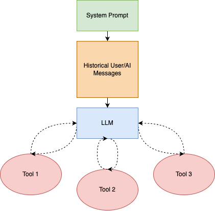
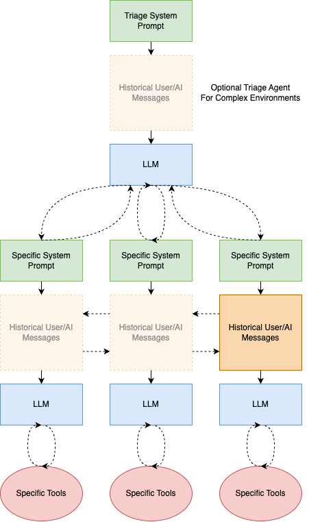

# Unleash The Swarm - Multi Agent Orchestration

Introducing a new proposed way of breaking down extensive agentic workflows- **Swarm**. Originally proposed by OpenAI in their [repo](https://github.com/openai/swarm) and [code research](https://cookbook.openai.com/examples/orchestrating_agents), they tackle the limitations of giving a single system prompt + multiple tools to an LLM for complex multi-step *routines* or processes.

  

    <h3>Traditional Function Calling Agent</h3>
    
  

  

    <h3>Multi Agent Orchestration with Swarm</h3>
    
  

The Swarm approach looks at agentic frameworks as **dynamic, context-aware switching between specialized agents to handle complex, multi-domain conversations more effectively.** Where:

1. **Dynamic Switching**: The ability to change agents mid-conversation based on the evolving needs of the interaction.
2. **Context-Aware**: Maintaining and transferring conversation history between agents, ensuring continuity and coherence.
3. **Specialized Agents**: Using focused, domain-specific agents instead of a single generalist agent.
4. **Complex, Multi-Domain Conversations**: Addressing the challenge of handling conversations that span multiple topics or require different types of expertise.
5. **Improved Effectiveness**: Aiming to provide more appropriate and accurate responses by leveraging specialized knowledge and tools for each part of the conversation.

In short, decomposing the task at hand across multiple specialized "agents" or "routines", orchestrated through the transfer of message history with specialized system prompts and corresponding functions to better execute on overarching plans. As a plus, this allows the dynamic switching between specific workflows, making it easier to specialize or tune specific routines via system prompts or tools.
